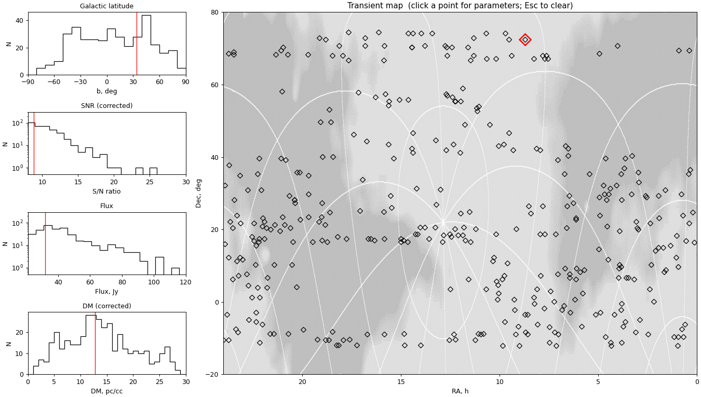

# UTR-2 Transient Analysis Map

A small, cross-platform Python program that displays radio-astronomy transients
detected by the **UTR-2 Pulsar/Transient Survey of the Northern Sky (UTPSNS)**
on top of a 20 MHz galactic background map and shows distribution histograms of
their main parameters. It is a re-implementation in Python of the original IDL
program `transientanalisys_380_flux_v2.pro`.

When you click on a transient on the map a small window opens with all the
parameters of the closest transient.



---

## What you need on your computer

* **Python 3.12** (any 3.12.x will do; 3.11 also works).
* **Tkinter** — the GUI toolkit. It is included with the official Python
  installer on Windows and macOS, and shipped as a system package on Linux.
  See the [Installing Tkinter](#installing-tkinter) section below if Python
  cannot find it.
* **Visual Studio Code** (recommended) or any other editor.
* About 200 MB free disk space for the Python virtual environment.

---

## Step-by-step setup with Visual Studio Code

The following steps work the same on Windows, macOS and Linux. They prepare a
private "virtual environment" (a folder named `.venv`) so that the libraries
this program needs do not interfere with anything else on your system.

### 1. Get the project on your computer

Either:

* clone the repository with Git:
  ```bash
  git clone <repository URL>
  cd vvz_transient_analysis_map
  ```
* or download a ZIP from your hosting site and unpack it.

### 2. Open the folder in VS Code

`File → Open Folder…` and choose the project folder. VS Code will open it.

If VS Code asks you whether you trust the authors, click **Yes**.

### 3. Install the Python extension (one-time)

In VS Code: `View → Extensions`, type **Python**, install the extension by
Microsoft. Restart VS Code if prompted.

### 4. Create a virtual environment

Open the integrated terminal: `View → Terminal` (or `` Ctrl+` ``).

Type one of the following depending on your platform.

**macOS / Linux**
```bash
python3 -m venv .venv
source .venv/bin/activate
```

**Windows (PowerShell)**
```powershell
py -3.12 -m venv .venv
.venv\Scripts\Activate.ps1
```

If PowerShell complains about execution policy:
```powershell
Set-ExecutionPolicy -Scope CurrentUser -ExecutionPolicy RemoteSigned
```
and re-try the activation.

You should see `(.venv)` at the beginning of the terminal prompt — that
confirms the environment is active.

VS Code may pop up a notification: **"We noticed a new venv. Use it for the
workspace?"** — click **Yes**. Otherwise: open the Command Palette
(`Ctrl+Shift+P` / `Cmd+Shift+P`), run **Python: Select Interpreter**, and pick
the interpreter inside `.venv`.

### 5. Install the required libraries

With the environment active:
```bash
pip install --upgrade pip
pip install -r requirements.txt
```
This installs `numpy`, `pandas`, `matplotlib`, `pillow` and `astropy`.

### 6. Run the program

```bash
python main.py
```

A window will open with:
* four small distribution histograms on the left,
* a large transient map on the right.

---

## Installing Tkinter

Tkinter ships with the standard CPython installer, but on some platforms it
must be installed separately.

### Windows
Tkinter is included with the [official python.org installer](https://www.python.org/downloads/windows/).
Make sure the installer option **"tcl/tk and IDLE"** is checked (it is by
default).

### macOS
Tkinter is bundled with the [official python.org installer](https://www.python.org/downloads/macos/).
If you installed Python via Homebrew, install the matching Tk:
```bash
brew install python-tk@3.12
```

### Linux
Most distributions ship Tkinter as a separate package.
* Debian / Ubuntu / Mint:
  ```bash
  sudo apt install python3-tk
  ```
* Fedora / RHEL:
  ```bash
  sudo dnf install python3-tkinter
  ```
* Arch:
  ```bash
  sudo pacman -S tk
  ```

To verify it works:
```bash
python -c "import tkinter; tkinter._test()"
```
A small test window with two buttons should appear.

---

## How to use the program

1. **Look at the histograms (left column)** — they show, for the SNR-filtered
   subset of transients:
   * Galactic latitude `b`
   * Corrected signal-to-noise ratio (SNR_corr)
   * Brightness temperature / flux
   * Corrected dispersion measure (DM_corr)

2. **Look at the transient map (right side)** — each diamond marker is one
   transient plotted at its (RA, Dec) sky position over the 20 MHz galactic
   background.

3. **Click a transient on the map.** The closest transient is highlighted in
   red, a thin red vertical line appears on each of the four histograms at
   that transient's value (so you can see at a glance where it falls in the
   overall distribution), and a small "Transient parameters" window pops up
   with:
   * `TRS #` — index in the catalog (1-based, matches the IDL "TRS #")
   * `RA` — right ascension in `Hh Mm Ss` and decimal hours
   * `DEC` — declination in degrees
   * `l`, `b` — galactic longitude and latitude in degrees
   * `SNR_CORR` — corrected signal-to-noise ratio
   * `FLUX` — flux in Jansky
   * `DM_CORR` — corrected dispersion measure (pc/cm³)

4. **Click another transient** — the highlight and the parameters window
   update to the new selection.

5. **Press `Esc`** in the main window or click **Close** in the parameters
   window — the map highlight, the histogram marker lines and the parameters
   window are all cleared.

6. **Zoom and pan** — the matplotlib toolbar at the bottom of the map lets you
   zoom in for crowded regions. Click the home icon to return to the full
   view.

---

## Command-line options

```
python main.py --help
```

```
--csv PATH            Transient CSV (default Data/Tr_380_Flux.csv)
--map PATH            Background JPEG (default assets/GalBackgr20MHz-1.jpg)
--snr-threshold NUM   Hide transients with SNR_corr below this value (default 8.0)
```

This makes it easy to point the program at a different dataset or background
image without editing the code.

---

## Project layout

```
vvz_transient_analysis_map/
├── main.py                       # entry point
├── requirements.txt
├── Data/
│   └── Tr_380_Flux.csv           # the transient catalog
├── assets/
│   └── GalBackgr20MHz-1.jpg      # 20 MHz galactic background image
├── Initial_idl_code/             # original IDL source (kept for reference)
└── src/
    ├── data/transient_loader.py  # CSV loader → in-memory catalog
    ├── coordinates/transforms.py # equatorial ↔ galactic (uses astropy)
    ├── maps/
    │   ├── base.py               # abstract BackgroundMap
    │   └── jpeg_map.py           # JPEG implementation
    ├── plots/histograms.py       # the four distribution histograms
    └── gui/
        ├── main_window.py        # the main tk + matplotlib window
        └── info_panel.py         # popup with transient parameters
```

The `BackgroundMap` abstraction is intended to make it easy to add other map
backends later (for example a real FITS image with WCS or a higher-resolution
all-sky survey). To add a new map type, write a class that derives from
`BackgroundMap`, implement the `extent` and `image` properties, and pass an
instance of it to `TransientMapApp`.

---

## Differences from the IDL version

* Coordinate conversion uses **astropy** instead of the bundled `glactc`
  routine. Output matches the IDL example in the original code (Altair: `gl =
  47.74°`, `gb = -8.91°`).
* The five separate IDL windows are merged into **one** main window with the
  histograms in the left column and the map on the right. The transient
  parameters still appear in a small popup, like in the IDL version.
* "ESC" is now an actual `Escape` key binding (and a Close button), instead of
  a click outside the map area.
* The matplotlib toolbar adds zooming/panning, which is helpful for the
  crowded sky regions.

---

## Troubleshooting

* **`ModuleNotFoundError: No module named 'tkinter'`** — install Tkinter for
  your platform (see the section above).
* **The window is empty / nothing happens when I click** — make sure
  `matplotlib`'s toolbar is in "no mode" (the zoom and pan buttons should not
  be highlighted). Clicks are ignored while zoom/pan is active.
* **`UnicodeDecodeError` on the CSV** — the loader already handles the
  non-ASCII column header in `Tr_380_Flux.csv`. If you supply your own CSV,
  make sure its column order matches the original (10 numeric columns).
* **Markers are off the map** — check that the JPEG you supplied actually
  covers `RA = 0…24h` × `Dec = -20…+80°`. Otherwise pass a different
  `MapExtent` to `JpegBackgroundMap`.
