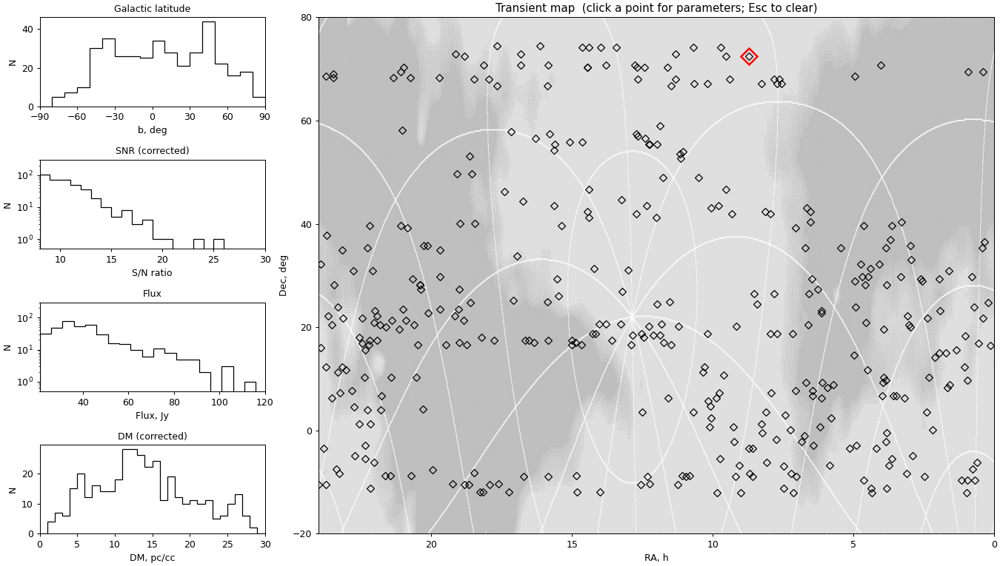

# UTR-2 Transient Analysis Map

A small, cross-platform project for exploring the radio-astronomy transients
detected by the **UTR-2 Pulsar/Transient Survey of the Northern Sky (UTPSNS)**
at a central frequency near 20 MHz. It is a re-implementation in Python of the
original IDL program `transientanalisys_380_flux_v2.pro`.

It ships in **two forms that share the same analysis code** in `src/`:

| | **Desktop viewer** | **MMODA web service** |
|---|---|---|
| Who runs it | you, locally | anyone, through a browser / `oda_api` |
| Front end | a Tkinter + matplotlib window | a web form on an [MMODA](https://www.astro.unige.ch/mmoda/) node |
| Interaction | click a transient on the map | fill a form: source / RA-Dec, radius, SNR, DM |
| Output | live popup, movable histogram markers | a catalogue table, a sky map and histograms as data products |
| Lives in | `main.py`, `src/gui/` | `mmoda/utr2_transients.ipynb`, `src/query.py`, `src/products.py` |

Because both front ends call into the same loader, coordinate transforms and
plotting code, a fix reaches both at once.



---

## Contents

- [Part I · Desktop viewer](#part-i--desktop-viewer)
  - [What you need](#what-you-need)
  - [Step-by-step setup with VS Code](#step-by-step-setup-with-vs-code)
  - [Installing Tkinter](#installing-tkinter)
  - [How to use the program](#how-to-use-the-program)
  - [Command-line options](#command-line-options)
  - [Differences from the IDL version](#differences-from-the-idl-version)
  - [Desktop troubleshooting](#desktop-troubleshooting)
- [Part II · MMODA web service](#part-ii--mmoda-web-service)
  - [What MMODA is (and is not)](#what-mmoda-is-and-is-not)
  - [How an MMODA service works](#how-an-mmoda-service-works)
  - [The service this repo exposes](#the-service-this-repo-exposes)
  - [What of the desktop code is reused](#what-of-the-desktop-code-is-reused)
  - [Replacing the interactivity](#replacing-the-interactivity)
  - [Running and testing the service locally](#running-and-testing-the-service-locally)
  - [Testing the full service in Docker](#testing-the-full-service-in-docker)
  - [Deploying to a real MMODA server](#deploying-to-a-real-mmoda-server)
  - [Open problems and caveats](#open-problems-and-caveats)
  - [A note on the container build (the `-e .` subtlety)](#a-note-on-the-container-build-the--e--subtlety)
  - [Deployment readiness](#deployment-readiness)
  - [Dependencies](#dependencies)
  - [One repository, mirrored — not two](#one-repository-mirrored--not-two)
  - [Roadmap](#roadmap)
  - [Work log](#work-log)
  - [References](#references)
- [Project layout](#project-layout)

---

# Part I · Desktop viewer

The desktop viewer displays the transients on top of a 20 MHz galactic
background map and shows distribution histograms of their main parameters. When
you click a transient on the map, a small window opens with all the parameters
of the closest one.

## What you need

* **Python 3.12** (any 3.12.x will do; 3.11 also works).
* **Tkinter** — the GUI toolkit. It is included with the official Python
  installer on Windows and macOS, and shipped as a system package on Linux.
  See the [Installing Tkinter](#installing-tkinter) section below if Python
  cannot find it.
* **Visual Studio Code** (recommended) or any other editor.
* About 200 MB free disk space for the Python virtual environment.

## Step-by-step setup with VS Code

The following steps work the same on Windows, macOS and Linux. They prepare a
private "virtual environment" (a folder named `.venv`) so that the libraries
this program needs do not interfere with anything else on your system.

### 1. Get the project on your computer

Either:

* clone the repository with Git:
  ```bash
  git clone <repository URL>
  cd vvz_transient_analysis_map
  ```
* or download a ZIP from your hosting site and unpack it.

### 2. Open the folder in VS Code

`File → Open Folder…` and choose the project folder. VS Code will open it.

If VS Code asks you whether you trust the authors, click **Yes**.

### 3. Install the Python extension (one-time)

In VS Code: `View → Extensions`, type **Python**, install the extension by
Microsoft. Restart VS Code if prompted.

### 4. Create a virtual environment

Open the integrated terminal: `View → Terminal` (or `` Ctrl+` ``).

Type one of the following depending on your platform.

**macOS / Linux**
```bash
python3 -m venv .venv
source .venv/bin/activate
```

**Windows (PowerShell)**
```powershell
py -3.12 -m venv .venv
.venv\Scripts\Activate.ps1
```

If PowerShell complains about execution policy:
```powershell
Set-ExecutionPolicy -Scope CurrentUser -ExecutionPolicy RemoteSigned
```
and re-try the activation.

You should see `(.venv)` at the beginning of the terminal prompt — that
confirms the environment is active.

VS Code may pop up a notification: **"We noticed a new venv. Use it for the
workspace?"** — click **Yes**. Otherwise: open the Command Palette
(`Ctrl+Shift+P` / `Cmd+Shift+P`), run **Python: Select Interpreter**, and pick
the interpreter inside `.venv`.

### 5. Install the required libraries

With the environment active:
```bash
pip install --upgrade pip
pip install -e .
```
This installs `numpy`, `pandas`, `matplotlib`, `pillow` and `astropy`.

> Use `pip install -e .`, **not** `pip install -r requirements.txt`. The
> requirements file is the one MMODA reads to build the online service (see
> [Part II](#part-ii--mmoda-web-service)) and additionally pulls in `oda-api`
> and about 36 further packages that the desktop viewer never uses.

### 6. Run the program

```bash
python main.py
```

A window will open with:
* four small distribution histograms on the left,
* a large transient map on the right.

## Installing Tkinter

Tkinter ships with the standard CPython installer, but on some platforms it
must be installed separately.

### Windows
Tkinter is included with the [official python.org installer](https://www.python.org/downloads/windows/).
Make sure the installer option **"tcl/tk and IDLE"** is checked (it is by
default).

### macOS
Tkinter is bundled with the [official python.org installer](https://www.python.org/downloads/macos/).
If you installed Python via Homebrew, install the matching Tk:
```bash
brew install python-tk@3.12
```

### Linux
Most distributions ship Tkinter as a separate package.
* Debian / Ubuntu / Mint:
  ```bash
  sudo apt install python3-tk
  ```
* Fedora / RHEL:
  ```bash
  sudo dnf install python3-tkinter
  ```
* Arch:
  ```bash
  sudo pacman -S tk
  ```

To verify it works:
```bash
python -c "import tkinter; tkinter._test()"
```
A small test window with two buttons should appear.

## How to use the program

1. **Look at the histograms (left column)** — they show, for the SNR-filtered
   subset of transients:
   * Galactic latitude `b`
   * Corrected signal-to-noise ratio (SNR_corr)
   * Brightness temperature / flux
   * Corrected dispersion measure (DM_corr)

2. **Look at the transient map (right side)** — each diamond marker is one
   transient plotted at its (RA, Dec) sky position over the 20 MHz galactic
   background.

3. **Click a transient on the map.** The closest transient is highlighted in
   red, a thin red vertical line appears on each of the four histograms at
   that transient's value (so you can see at a glance where it falls in the
   overall distribution), and a small "Transient parameters" window pops up
   with:
   * `TRS #` — index in the catalog (1-based, matches the IDL "TRS #")
   * `RA` — right ascension in `Hh Mm Ss` and decimal hours
   * `DEC` — declination in degrees
   * `l`, `b` — galactic longitude and latitude in degrees
   * `SNR_CORR` — corrected signal-to-noise ratio
   * `FLUX` — flux in Jansky
   * `DM_CORR` — corrected dispersion measure (pc/cm³)

4. **Click another transient** — the highlight and the parameters window
   update to the new selection.

5. **Press `Esc`** in the main window or click **Close** in the parameters
   window — the map highlight, the histogram marker lines and the parameters
   window are all cleared.

6. **Zoom and pan** — the matplotlib toolbar at the bottom of the map lets you
   zoom in for crowded regions. Click the home icon to return to the full
   view.

## Command-line options

```
python main.py --help
```

```
--csv PATH            Transient CSV (default Data/Tr_380_Flux.csv)
--map PATH            Background JPEG (default assets/GalBackgr20MHz-1.jpg)
--snr-threshold NUM   Hide transients with SNR_corr below this value (default 8.0)
```

This makes it easy to point the program at a different dataset or background
image without editing the code.

## Differences from the IDL version

* Coordinate conversion uses **astropy** instead of the bundled `glactc`
  routine. Output matches the IDL example in the original code (Altair: `gl =
  47.74°`, `gb = -8.91°`).
* The five separate IDL windows are merged into **one** main window with the
  histograms in the left column and the map on the right. The transient
  parameters still appear in a small popup, like in the IDL version.
* "ESC" is now an actual `Escape` key binding (and a Close button), instead of
  a click outside the map area.
* The matplotlib toolbar adds zooming/panning, which is helpful for the
  crowded sky regions.

## Desktop troubleshooting

* **`ModuleNotFoundError: No module named 'tkinter'`** — install Tkinter for
  your platform (see the section above).
* **The window is empty / nothing happens when I click** — make sure
  `matplotlib`'s toolbar is in "no mode" (the zoom and pan buttons should not
  be highlighted). Clicks are ignored while zoom/pan is active.
* **`UnicodeDecodeError` on the CSV** — the loader already handles the
  non-ASCII column header in `Tr_380_Flux.csv`. If you supply your own CSV,
  make sure its column order matches the original (10 numeric columns).
* **Markers are off the map** — check that the JPEG you supplied actually
  covers `RA = 0…24h` × `Dec = -20…+80°`. Otherwise pass a different
  `MapExtent` to `JpegBackgroundMap`.

---

# Part II · MMODA web service

Everything below is about exposing the catalogue and its analysis as an online
service on **MMODA** (Multi-Messenger Online Data Analysis). The desktop viewer
in Part I is **not** affected by anything here.

**Status:** working service notebook, verified end to end with papermill,
validated against `nb2workflow`, and **built and served in a real container
with Docker** (see [Testing the full service in Docker](#testing-the-full-service-in-docker)).
Not yet submitted — deployment is still blocked on the hosting question in
[Deploying to a real MMODA server](#deploying-to-a-real-mmoda-server).
**Started:** 2026-07-25. **Target node:** BITP / Kyiv.

## What MMODA is (and is not)

MMODA is **not a data archive**. You cannot "upload a database" to it. It is a
platform that hosts *parameterized analysis workflows* ("services") which run on
demand and return data products.

That splits the goal into two independent tracks:

| Track | Goal | Where it lives |
|---|---|---|
| **A — Catalog** | Give the catalog a real, citable, VO-queryable archival home | VizieR / CDS (external) |
| **B — Service** | Turn the analysis + plots into an MMODA workflow | this repository |

The two do not block each other. Track A is the durable scientific contribution
and is worth doing regardless of whether Track B ever ships. Track B is what
makes the data *interactive* for other researchers, and is what this Part II is
about.

## How an MMODA service works

A service is a Jupyter notebook (here `mmoda/utr2_transients.ipynb`) with two
cells tagged for [papermill](https://papermill.readthedocs.io/), converted into
a containerized web service by [`nb2workflow`](https://github.com/oda-hub/nb2workflow).

### The `parameters` cell → becomes the web form

```python
# oda:version "v0.1.0"
# oda:reference "10.xxxx/yyyy"          # a bare DOI — see the rules below

src_name      = "Cas A"   # http://odahub.io/ontology#AstrophysicalObject
RA            = 350.85    # http://odahub.io/ontology#PointOfInterestRA
DEC           = 58.815    # http://odahub.io/ontology#PointOfInterestDEC
radius        = 180.0     # http://odahub.io/ontology#AngleDegrees ; oda:upper_limit 180.
snr_threshold = 8.0       # http://odahub.io/ontology#Float ; oda:lower_limit 0.
```

Annotation notes:

- `oda:` is shorthand for `http://odahub.io/ontology#`.
- Parameters annotated with `PointOfInterestRA` / `PointOfInterestDEC` /
  `AstrophysicalObject` / `StartTime` / `EndTime` are **automatically** rendered
  in MMODA's shared common-parameter header, with the standard names
  `RA`, `DEC`, `src_name`, `T1`, `T2`. When a user types a source name, MMODA
  resolves it to RA/Dec and fills those fields.
- Constraints: `oda:lower_limit`, `oda:upper_limit`, `oda:allowed_value`, `oda:unit`.
- Presentation: `oda:label` (field title), `oda:description` (tooltip),
  `oda:group` (groups fields horizontally).
- File inputs: `oda:POSIXPath` (upload widget), `oda:FileURL` (URL text field).

> **Two rules when editing the parameters cell.** Both fail *silently* — the
> notebook still runs and still looks right — so both are enforced by
> `tests/test_notebook.py`:
>
> 1. **Keep each annotation on the same line as its assignment**, however long.
>    `nb2workflow` attaches to a parameter only the comment found on the
>    statement's *last* line; a wrapped continuation comment silently becomes a
>    *notebook-level* annotation, and the parameter loses its label, limits and
>    description. (See [Open problems](#open-problems-and-caveats), item 10.)
> 2. **Write `oda:reference` as a bare DOI, never as a URL.** `nb2workflow`
>    wraps anything starting with `http` in angle brackets and swallows the
>    closing quote, dropping the reference entirely. Use `"10.xxxx/yyyy"`, not
>    `"https://doi.org/10.xxxx/yyyy"`. (See [Open problems](#open-problems-and-caveats),
>    item 11.)

### The `outputs` cell → becomes the data products

```python
transient_table = ODAAstropyTable(transients)  # http://odahub.io/ontology#ODAAstropyTable
sky_map         = "utr2_sky_map.png"           # http://odahub.io/ontology#ODAPictureProduct
histograms      = "utr2_histograms.png"        # http://odahub.io/ontology#ODAPictureProduct
query_summary   = summary                       # http://odahub.io/ontology#WorkflowResultComment
```

Outputs may be scalars, arrays, astropy tables (wrapped — see
[Open problems](#open-problems-and-caveats), item 12), or **filenames** — if a
filename is given, the whole file becomes the product. `WorkflowResultComment`
is a special type rendered as a yellow notice box rather than a downloadable
product.

### Execution model — the key constraint

```
web form  →  papermill runs the notebook HEADLESS  →  static products
```

There is **no event loop, no callback, no live window**. Whatever the notebook
produces is what the user sees. This is the single most important fact driving
the design: the desktop app's click-to-inspect loop has no equivalent and must
be re-expressed as parameters and products.

## The service this repo exposes

### Parameters it accepts

| Parameter | Default | Ontology type | Meaning |
|---|---|---|---|
| `src_name` | `"Cas A"` | `AstrophysicalObject` | Resolved by MMODA into RA/Dec; used for the sky map title |
| `RA` | `350.85` | `PointOfInterestRA` | Cone centre, degrees (FK5 J2000) |
| `DEC` | `58.815` | `PointOfInterestDEC` | Cone centre, degrees (FK5 J2000) |
| `radius` | `180.0` | `AngleDegrees` | Cone radius, degrees. **180 = whole sky** |
| `snr_threshold` | `8.0` | `Float` | Keep transients with *corrected* SNR strictly above this |
| `dm_min` / `dm_max` | `0.0` / `100.0` | `Float` | Corrected DM range, pc/cm³, inclusive |

A cone search is applied only when the radius is smaller than 180 degrees;
otherwise the whole catalogue is returned, filtered by SNR and DM alone.
Separations are true great-circle angular distances, so cone searches stay
correct near the celestial pole.

### Products it returns

| Output | Ontology type | Meaning |
|---|---|---|
| `transient_table` | `ODAAstropyTable` | The matching transients, with per-column units and descriptions; downloadable as FITS/VOTable/ECSV |
| `sky_map` | `ODAPictureProduct` | Selected transients as diamonds over the 20 MHz background; cone centre and boundary in red |
| `histograms` | `ODAPictureProduct` | Distributions of galactic latitude, corrected SNR, flux `S_o` and corrected DM |
| `query_summary` | `WorkflowResultComment` | One-line description of what was selected |

The catalogue contains 380 transients. It is a static, already-published
catalogue: the service does not query a live archive, so results are
reproducible and fast.

## What of the desktop code is reused

Tk is confined to `src/gui/` only (verified — no `pyplot`, no `tkinter` imports
anywhere else), so everything else is headless-safe and imports cleanly into a
notebook.

| Module | Fate in MMODA |
|---|---|
| `src/data/transient_loader.py` | **Reuse as-is** |
| `src/coordinates/transforms.py` | **Reuse as-is** (astropy) |
| `src/plots/histograms.py` | **Reuse** — takes a `Figure`, no pyplot → `fig.savefig()` → `ODAPictureProduct` |
| `src/maps/base.py`, `src/maps/jpeg_map.py` | **Reuse** — `render(ax)` is pure matplotlib |
| `src/gui/main_window.py`, `src/gui/info_panel.py` | **Drop** — tkinter |
| `main.py` | **Rewrite** as the parameters + orchestration cells |

Roughly **75% of the code ports directly**. The `BackgroundMap` abstraction is
exactly the right seam — the notebook just needs a `BackgroundMap` instance and
a `Figure`. `main.py` calls `matplotlib.use("TkAgg")`; the notebook uses the
`Agg` backend (headless) instead, which `tests/test_notebook.py` enforces.

Modules added for the service, all head-less and all covered by tests:

| Module | Purpose |
|---|---|
| `src/query.py` | Cone search, SNR/DM filtering, RA hours↔degrees conversion, `NoTransientsFound` |
| `src/products.py` | `QueryResult` → annotated astropy `Table` with units and descriptions |
| `src/plots/skymap.py` | Head-less sky map rendering, including an exact cone outline |

## Replacing the interactivity

| Desktop app | MMODA service |
|---|---|
| Click a point on the map | **Cone search** — `RA`, `DEC`, `radius` parameters |
| Popup info panel with one transient | **`ODAAstropyTable`** — full filtered subset, browsable and downloadable |
| Red marker line on histograms | Histograms computed over the *filtered subset* the user selected |
| SNR threshold constant | An exposed form parameter |
| Zoom / pan toolbar | (lost — static PNG) |

The user loses "point and click", and gains "query programmatically, get a real
table back in your own notebook". For a survey catalog that is arguably the more
useful mode.

## Running and testing the service locally

### 1. Install

```bash
pip install -r requirements.txt      # service + oda-api (about 53 packages)
pip install -e .[test]               # or just the test tooling
```

For the desktop viewer alone, `pip install -e .` is enough and skips `oda-api`.

The editable install is what lets the notebook run irrespective of the working
directory: papermill executes with the *caller's* working directory, not the
notebook's, so the notebook cannot rely on relative paths. It falls back to
searching upwards for `src/query.py`, and honours `UTR2_REPO_ROOT` as a last
resort, but installing the package is the clean path.

### 2. Run the test suite

```bash
pytest                      # 56 tests, ~50 s (includes real notebook runs)
pytest -m "not slow"        # skip the execution tests
```

`TestOutputGathering` is the most important class in the suite: it runs the
notebook through `NotebookAdapter.execute()` — MMODA's actual path — and checks
that the declared outputs are really *gathered* by scrapbook, not merely
declared. That is a separate failure domain from execution (see
[Open problems](#open-problems-and-caveats), item 12), and papermill cannot see
it.

`TestNb2WorkflowIntrospection` parses the notebook with **nb2workflow itself** —
the same tool MMODA runs — and asserts that all 7 parameters keep their labels,
that `radius` keeps both limits, that the 4 outputs keep their ontology types,
and that nothing leaked to the notebook level. It also fails the build on any
`is not in ontology` warning, because **nb2workflow does not reject an invented
ontology class** — a typo in an annotation would otherwise reach a deployed
service as a meaningless type. Our seven parameter types and four output types
currently produce **none**.

### 3. Run the notebook by hand

```bash
# whole sky
papermill mmoda/utr2_transients.ipynb out.ipynb -k python3

# cone search around Cas A
papermill mmoda/utr2_transients.ipynb out.ipynb -k python3 \
    -p src_name "Cas A" -p RA 350.85 -p DEC 58.815 -p radius 20.0
```

It writes `utr2_sky_map.png` and `utr2_histograms.png` into the working
directory (both git-ignored). A whole-sky run reports `380 of 380`; a 20° cone
around Cas A reports `10 of 380`; an impossible query fails with an explanatory
message rather than a bare traceback.

## Testing the full service in Docker

This is optional but **recommended before deployment**: it runs the service in
the very same kind of container MMODA builds (base image `mambaorg/micromamba`,
served by `nb2service`), entirely on your machine. It was verified working on
2026-07-28.

The helper script `mmoda/build_local_image.py` reproduces MMODA's real build: it
takes a clean snapshot of your last commit, renders the Dockerfile from
`nb2workflow`'s own template (honouring `mmoda.yaml`, so the notebook is found in
`mmoda/`), and builds the image. It does **not** need Kubernetes or a registry.

### Step 0 — Install Docker

Install **Docker Desktop** (Windows/macOS) or Docker Engine (Linux) and start
it. Confirm it works:

```bash
docker run --rm hello-world
```

### Step 1 — Prepare a Python environment

From the repository root, in your activated `.venv`:

```bash
pip install -r requirements.txt nb2workflow
```

The build uses your **last commit**, not the working tree, so commit any
notebook edits first.

### Step 2 — Build the image

```bash
python mmoda/build_local_image.py --build
```

The first build takes several minutes (it downloads the base image and installs
the whole scientific stack). It produces an image named `nb-utr2:local`. To only
generate and inspect the Dockerfile without building, drop `--build`.

### Step 3 — Run the service

```bash
docker run -d --name utr2svc -p 8000:8000 nb-utr2:local
```

Check it is up (either command):

```bash
curl http://localhost:8000/health          # -> {"message": "all is ok!", ...}
```

or open <http://localhost:8000/> in a browser. To see the form definition —
every parameter and product — open <http://localhost:8000/api/v1.0/options>.

### Step 4 — Query it

Whole sky (expect `380 of 380`):

```bash
curl "http://localhost:8000/api/v1.0/get/utr2_transients?radius=180" -o result.json
```

Cone search around Cas A (expect `10 of 380`):

```bash
curl "http://localhost:8000/api/v1.0/get/utr2_transients?src_name=Cas+A&RA=350.85&DEC=58.815&radius=20" -o result.json
```

The JSON has `output.query_summary` (the one-line summary), `output.transient_table`
(the table as self-describing ECSV text), and the two figures as base64 PNGs in
`output.sky_map_content` and `output.histograms_content`.

An **impossible** query returns HTTP 500 with the reason in `exceptions`, e.g.
`No transients in the UTR-2 catalogue match this query (SNR_corr > 10000.0; …)`.
That is intentional: MMODA renders a raised exception's message to the user, so
a "nothing matched" result explains itself instead of returning an empty product.

### Step 5 — Run MMODA's own monitoring test inside the container

MMODA runs `test_*.ipynb` notebooks to check a workflow still behaves. Run ours
in the container's environment:

```bash
docker run --rm nb-utr2:local bash -c \
  "cd /tmp && micromamba run -n base papermill /repo/mmoda/test_utr2_transients.ipynb /tmp/out.ipynb -k python3 --log-output"
```

`All UTR-2 transient service tests passed.` means the service is healthy.

### Step 6 — Stop and clean up

```bash
docker rm -f utr2svc                 # stop and remove the container
docker image rm nb-utr2:local        # optional: reclaim ~2.8 GB
```

> **Windows note.** These `curl` commands work in PowerShell (which ships
> `curl`) and in Git Bash. In PowerShell you may prefer
> `Invoke-RestMethod "http://localhost:8000/health"`.

## Deploying to a real MMODA server

**You do not build or run the production container yourself.** MMODA's build bot
does that from a copy of this repository on *its* GitLab. Your job is to put the
repo where the bot can find it, mark it, and let the bot build and deploy. The
local Docker test above is only a rehearsal.

### ⚠️ Step 0 — Resolve the hosting question first (current blocker)

The historically documented path used `gitlab.renkulab.io`, which **stopped
accepting new projects** and was slated for shutdown in **January 2026** (now
past). The [migration issue](https://github.com/oda-hub/hugo-odahub/issues/129)
was still undecided between `gitlab.com/mmoda` and an IN2P3 GitLab instance when
last public, and the official docs may be stale.

**Before anything else, email `contact@odahub.io`** and ask:

- Where are new MMODA workflows hosted now, post-Renku-shutdown?
- Can we get namespace access?
- Is the `live-workflow` topic mechanism still how deployment is triggered?
- Do they want the catalog in VizieR first, or is a repo-bundled CSV acceptable?

MMODA is **federated** — the same workflow deploys across several nodes:

| Site | URL |
|---|---|
| UNIGE (Geneva) — main | https://www.astro.unige.ch/mmoda/ |
| APC / Paris | https://si-apc.pages.in2p3.fr/face-website/service/mmo/ |
| **BITP / Kyiv** | https://ui.oda.virgoua.org/mmoda/ |

The **Kyiv (BITP) node is worth approaching directly** — UTR-2 is a Ukrainian
instrument, and a local node is the most natural home for a Ukrainian survey
catalog. They may also be more motivated to help push it through than the
general contact address. Nothing here should be considered final until this is
answered.

### Step 1 — Get namespace access on MMODA's GitLab

From the answer to Step 0 you will learn which GitLab instance/namespace to use.

### Step 2 — Mirror this repository there

GitHub stays the source of truth; MMODA gets a **mirror**, not a fork (it
discovers workflows from its own GitLab, not from GitHub). Either push a mirror:

```bash
git remote add mmoda <gitlab-repo-url>
git push mmoda main
```

or configure a GitLab **pull mirror** of the GitHub repository. The repo is
under 1 MB of tracked files, so mirroring all of it costs nothing.

### Step 3 — Confirm the files MMODA reads at the repository root

All of these already exist and are correct:

- `requirements.txt` — pip dependencies (`-e .[mmoda]`, i.e. the code + `oda-api`)
- `environment.yml` — conda environment (pins `python=3.12`, adds `libmagic`)
- `mmoda.yaml` — points MMODA at `mmoda/utr2_*.ipynb`
- `mmoda_help_page.md` — help text shown on the service page
- `acknowledgements.md` — attribution / data-provider credits
- `mmoda/utr2_transients.ipynb` — the service notebook
- `mmoda/test_utr2_transients.ipynb` — the monitoring test (excluded from becoming a service)

### Step 4 — Mark the project as a live workflow

In the GitLab **project settings**, add the topic **`live-workflow`**.

### Step 5 — Let the bot build and deploy

A bot scans the namespace, converts the notebook to a service with
`nb2workflow`, builds the container, and deploys it. Monitor CI/CD; a
confirmation arrives by email.

### Step 6 — Verify in the MMODA frontend

Open the service on the target node (e.g. the Kyiv URL above), run a whole-sky
query and a Cas A cone (`RA=350.85`, `DEC=58.815`, `radius=20` → `10 of 380`),
and hand these test parameters to the node's team.

### Before you submit — checklist

- [ ] Real UTPSNS publication **DOI** in `oda:reference` — **bare DOI, not a URL**
- [ ] `acknowledgements.md` completed (survey authors, citation, licence, image provenance)
- [ ] Local Docker test green (the section above)
- [ ] `pytest` green

## Open problems and caveats

These are real issues, ordered by how much they matter. Items 2, 9, 10, 11, 12
and 13 are already handled in code; the rest need input or a future change.

1. **No absolute epoch.** `time_from_start` is seconds from an *unspecified*
   observation start. MMODA services are normally filterable by `T1`/`T2`, and
   we cannot support that without the observation start dates, so those common
   parameters are deliberately not offered. This is the biggest scientific gap
   and is worth fixing at the catalog level regardless of MMODA. **Needs input
   from the survey team.**
2. ~~**RA units mismatch.**~~ *Handled 2026-07-26.* The CSV stores RA in
   **hours** (0–24); `PointOfInterestRA` is in **degrees**. All of `src/query.py`
   and `src/products.py` work in degrees, the published table carries both `RA`
   (deg) and `RA_hours`, and `tests/test_products.py` asserts the conversion.
3. **No positional uncertainties.** Cone-search semantics are ill-defined
   without a per-transient error radius. Currently we can only do
   "nearest / within radius of the nominal position". Choose a radius generous
   enough to allow for the survey's positional accuracy.
4. **Background JPEG has no WCS.** `assets/GalBackgr20MHz-1.jpg` is an assumed
   RA/Dec rectangle (RA 24h→0h, Dec −20°→+80°) with no real astrometry. Fine as
   a picture for orientation, not acceptable as a measured VO product. Natural
   fix: a new `BackgroundMap` subclass backed by a real FITS / HEALPix
   low-frequency sky map.
5. **CSV hygiene.** The header line contains non-ASCII characters (the loader
   works around this with `encoding="latin-1"` and skipping the header), and at
   least one value has stray internal whitespace (`"24 .26"`). Clean this before
   anything is published anywhere.
6. **Provenance and credit.** Needs an `oda:reference` DOI for the UTPSNS
   publication, plus `acknowledgements.md` crediting the data providers.
7. **Column semantics.** The IDL histogram labelled "Flux, Jy" actually plots
   `Tx1000_K` (brightness temperature), not `S_o`. The Python code deliberately
   uses `S_o`. Any published table must document what each column really is
   (`src/products.py` does).
8. ~~**Support files must move to the repository root at submission time.**~~
   *Handled 2026-07-28.* MMODA reads `requirements.txt`, `environment.yml`,
   `mmoda_help_page.md`, `acknowledgements.md` and `mmoda.yaml` from the
   **repository root**; they now live there. `mmoda.yaml` keeps the notebook
   itself tidily in `mmoda/`.
9. **`u.hourangle` is not FITS-representable.** Discovered by the round-trip
   test: attaching that unit to `RA_hours` makes `Table.write(..., format="fits")`
   raise `UnitScaleError`, which would break the download product. The column is
   therefore published without a unit, with the units stated in its description.
10. **Wrapped annotation comments are silently reassigned.** `nb2workflow`
    attaches to a parameter only the comment on the statement's **last line**;
    every other comment falls through to a "standalone" list and becomes a
    *notebook-level* annotation. A parameter written across two lines therefore
    loses its upper limit, its label and its description, while the notebook
    acquires a nonsensical `oda:label`. Nothing raises. **Keep every annotation
    on one line.** Enforced by `tests/test_notebook.py`.
11. **`oda:reference` cannot hold a URL.** `nb2workflow/semantics.py` wraps
    anything starting with `http` in angle brackets and swallows the closing
    quote, yielding unparseable Turtle that is discarded without warning — this
    breaks the *exact example in the official ODA development guide*. Write the
    reference as a **bare DOI**: `oda:reference "10.1051/0004-6361/202037850"`.
    Worth reporting upstream to oda-hub.
12. **A bare astropy `Table` output silently yields *no products at all*.** The
    worst bug found, and invisible to every earlier check. MMODA gathers outputs
    by injecting a cell that calls `scrapbook.glue()` on each declared output;
    `nb2workflow`'s `denumpyfy()` does not descend into an astropy `Table`, so
    gluing one raises `Object of type int64 is not JSON serializable`, the whole
    gathering cell dies, and `extract_output()` returns `{}` — **zero** products,
    not three of four. The notebook still runs perfectly under papermill, and
    `nb2workflow` still reports four correctly typed *declarations*. Fix: wrap the
    table — `transient_table = ODAAstropyTable(transients)`. This is why `oda-api`
    is a hard requirement. Guarded by `tests/test_notebook.py::TestOutputGathering`.
13. **`nbadapter.run()` discards execution errors.** It ignores what `execute()`
    returns, so a failed workflow comes back as an empty dict with nothing
    raised. Tests that assert on failure call `execute()` and inspect the
    returned exceptions — which is also what MMODA does, so the user *does* see
    our `NoTransientsFound` message.

Non-problem: the catalog is ~25 KB / 380 rows, small enough to ship inside the
repo. MMODA's guidance only warns against embedding *large* datasets.

Non-problem: the default filters (`SNR_corr > 8`, `Dec < 75`) exclude nothing —
all 380 rows pass, because the published catalog is already pre-filtered. A
default run returns the whole catalog, a sensible landing state for the service.

## A note on the container build (the `-e .` subtlety)

The MMODA container installs the code by running `pip install -r
/repo/requirements.txt`, whose first line is `-e .[mmoda]`. A subtlety worth
recording, because it *works today but only because two things happen to line
up*:

- pip resolves `-e .` in a requirements file **relative to the current working
  directory**, not to the file's location. MMODA's generated Dockerfile runs
  that `pip install` from `/tmp` (the `mambaorg/micromamba` WORKDIR), where
  `-e .` cannot resolve — and that line is guarded by `|| :`, so its failure is
  **silently ignored**.
- The editable install nonetheless succeeds *earlier*, via the `pip: -r
  requirements.txt` sub-section of `environment.yml`, which `micromamba install`
  runs from `/repo`. There `-e .` resolves correctly, and the package lands as
  editable at `/repo`. Verified: the built image reports
  `utr2-transient-map 0.1.0 /repo` and imports `src` fine.

So on MMODA's exact toolchain (micromamba + an `environment.yml` with a
`pip:` sub-section) the container is correct. The fragility is that if a future
build ever dropped `environment.yml`, or ran the pip sub-section from elsewhere,
the container would build **successfully** yet be missing every scientific
dependency, with the failure hidden by `|| :`. If you ever want to remove that
hidden dependency, list the runtime packages in `requirements.txt` **without**
the `-e .` line and let the notebook's existing search-upwards fallback (or
`UTR2_REPO_ROOT`) make `src` importable. Low priority while `environment.yml`
stays as it is.

## Deployment readiness

| Check | State |
|---|---|
| Notebook runs head-lessly, from any working directory | ✅ verified with papermill |
| Parameter injection works | ✅ verified (cone search returns 10/380) |
| nb2workflow discovers all 7 parameters with labels/limits/groups | ✅ verified |
| nb2workflow discovers all 4 outputs with correct types | ✅ verified |
| All annotated types resolve in the real ODA ontology | ✅ verified (no warnings) |
| `oda:version` and `oda:reference` reach the notebook graph | ✅ verified |
| Failure path gives a readable message | ✅ verified via `execute()` exceptions |
| All 4 outputs actually gathered by scrapbook | ✅ verified (item 12) |
| Figures arrive as base64 file content | ✅ verified |
| Support files at repository root | ✅ done 2026-07-28 |
| `test_*.ipynb` for MMODA's automated monitoring | ✅ `mmoda/test_utr2_transients.ipynb`, passing |
| **Container build + service run in Docker** | ✅ **verified 2026-07-28** — built with `nb2workflow`'s own Dockerfile, served on :8000, whole-sky + cone + failure paths all correct |
| Real publication DOI in `oda:reference` | ❌ placeholder points at the repo |
| Hosting namespace confirmed | ❌ **blocked** — see [Deploying to a real MMODA server](#deploying-to-a-real-mmoda-server) |

Everything checkable without a namespace now passes. The two remaining items are
one piece of missing information (the DOI) and the hosting blocker.

## Dependencies

Measured with `pip install --dry-run --report`:

| Requirement set | Packages | Command |
|---|---|---|
| Desktop viewer only (`numpy`, `pandas`, `matplotlib`, `pillow`, `astropy`) | ~17 | `pip install -e .` |
| Same **+ `oda-api`** (the MMODA service) | ~53 (+36) | `pip install -r requirements.txt` |

The +36 include `scipy`, `bokeh`, `astroquery`, `pyvo`, `rdflib`, `keyring`,
`tornado` and `jsonschema`. `oda-api` is a **hard** requirement for the service,
not optional: without `oda_api.data_products.ODAAstropyTable`, output gathering
dies and the service returns nothing (item 12). The cost is contained by
declaring it as the `mmoda` extra in `pyproject.toml`, so a desktop user who runs
`pip install -e .` never pays for it. (Verified in the built container:
`astropy 8.0.1`, `numpy 2.5.1`, `pandas 3.0.5`, `oda_api 1.3.5`,
`nb2workflow 1.3.118`, Python 3.12.)

## One repository, mirrored — not two

*Decided 2026-07-28.* The MMODA service and the desktop application stay in this
single repository. The decisive point is that MMODA discovers workflows from its
own GitLab namespace, not from GitHub, so a copy has to exist on their GitLab
either way — and that copy should be a **mirror** of this repo (GitHub stays the
source of truth), not a fork.

Keeping one repository also means the notebook imports `src/` directly (splitting
would force either duplicated code or publishing `src` to PyPI), one test suite
covers both paths, and a fix to the loader or the coordinate transform reaches
both at once. The cost is a handful of MMODA-specific files at the repository
root that mean nothing to a desktop user.

Revisit this if the workflow ever needs heavy dependencies the desktop app should
not carry (`healpy`, `astroquery`), or if a different team takes over the MMODA
side.

## Roadmap

### Track A — Catalog (independent, do regardless)

- [ ] Recover absolute observation epochs for `time_from_start`
- [ ] Add per-transient positional uncertainties (if recoverable)
- [ ] Clean the CSV: ASCII header, fix stray whitespace, document every column
- [ ] Write a column-by-column data dictionary with units
- [ ] Prepare and submit the VizieR/CDS package
- [ ] Obtain / confirm the UTPSNS publication DOI

### Track B — MMODA service

- [ ] **Contact the BITP/Kyiv node** — target node, likeliest ally ← *do this first*
- [ ] Email `contact@odahub.io` — resolve the hosting blocker
- [x] Draft `utr2_transients.ipynb`: parameters cell, orchestration, outputs cell
- [x] Cone-search + SNR/DM filtering helper — `src/query.py`
- [x] RA hours ↔ degrees conversion, with a test
- [x] Headless figure rendering: histograms → PNG, sky map → PNG
- [x] Build the `ODAAstropyTable` output with proper units and column metadata
- [x] `requirements.txt` / `environment.yml` for the service container
- [x] `mmoda_help_page.md` and `acknowledgements.md`
- [x] `mmoda.yaml`
- [x] Verify end to end with papermill, including parameter injection
- [x] Install `nb2workflow` and validate the annotations it actually parses
- [x] `mmoda/test_utr2_transients.ipynb` in MMODA's own test-notebook form
- [x] Move the support files to the repository root
- [x] Verify outputs are really gathered, not just declared
- [x] Local container build + `nb2service` run, verified with Docker
- [ ] Fill in the real `oda:reference` DOI — **bare DOI, not a URL**
- [ ] Report the `oda:reference` URL bug upstream to oda-hub
- [ ] Deploy, verify in the MMODA frontend, supply test parameters to the team

### Nice to have / later

- [ ] `FitsBackgroundMap` — real WCS sky map replacing the JPEG (fixes item 4)
- [ ] Support `T1`/`T2` time filtering (needs item 1 resolved)
- [ ] Expose the catalog through a VO TAP service

## Work log

Newest first. One entry per session — what was done, decided, and what is next.

### 2026-07-28 (later) — Container build verified with Docker

- Built the service container the way MMODA does — rendered the Dockerfile from
  `nb2workflow`'s own template (the modern `nb2workflow.deploy` path, which reads
  `mmoda.yaml`, base image `mambaorg/micromamba`), from a clean `git archive
  HEAD`. Added `mmoda/build_local_image.py` so anyone can reproduce it with one
  command.
- Ran the container and exercised the HTTP API: `/health` OK, `/api/v1.0/options`
  lists all 7 parameters and 4 products, a whole-sky query returns `380 of 380`,
  a 20° Cas A cone returns `10 of 380`, and an impossible query returns HTTP 500
  carrying the `NoTransientsFound` explanation. Both figures come back as valid
  base64 PNGs; the table as self-describing ECSV. MMODA's own
  `test_utr2_transients.ipynb` passes *inside* the container.
- **Recorded the `-e .` container subtlety** (see its section above): the
  requirements `-e .` line fails silently under `|| :` from `/tmp`, but the
  editable install still succeeds via the `environment.yml` pip sub-section run
  from `/repo`. Works on MMODA's toolchain; documented as a latent fragility.
- Merged the former `mmoda/README.md` into this root README so there is a single
  source of truth for both front ends.
- **Next:** the real DOI, then contact the Kyiv node.

### 2026-07-28 — Root layout, test notebook, and the worst bug yet

- **Decided:** one repository, mirrored to MMODA's GitLab rather than forked.
- Moved `requirements.txt`, `environment.yml`, `mmoda.yaml`,
  `mmoda_help_page.md` and `acknowledgements.md` to the repository root.
- **Found the worst bug so far (item 12).** A bare astropy `Table` output cannot
  be glued by scrapbook, which kills the whole output-gathering cell and returns
  **zero** products — not three of four — while the notebook runs perfectly and
  declares four correct outputs. Fixed by wrapping in `ODAAstropyTable`.
- **Correction:** the earlier note that `oda-api` could be dropped was wrong; it
  is a hard requirement. Kept it off the desktop path via the `mmoda` extra.
- Also found that `nbadapter.run()` swallows execution errors (item 13).
- Wrote `mmoda/test_utr2_transients.ipynb`; it passes. Suite is now 56 tests.

### 2026-07-26 (later) — Validated against nb2workflow, two silent bugs fixed

Ran the notebook through `nb2workflow`'s own `NotebookAdapter` — the tool MMODA
uses — rather than trusting the documentation. It found two defects no amount of
running the notebook would have revealed:

- **Wrapped annotation comments were being silently reassigned** to the notebook
  instead of the parameter (item 10). Four of seven parameters had lost their
  labels, descriptions and groups, and `radius` had lost its 180° upper limit.
  Fixed by putting every annotation on one line.
- **`oda:reference` was being dropped entirely** because it held a URL (item 11).
  Fixed by using a bare reference; worth reporting upstream.

Also established that nb2workflow accepts invented ontology classes with only a
log line, so `test_no_unknown_ontology_terms` now fails the build on any `is not
in ontology` warning. Added `TestAnnotationsAreSelfContained` and
`TestNb2WorkflowIntrospection`.

### 2026-07-26 — First working service notebook

- **Decided:** target the **BITP/Kyiv** node.
- Built the head-less analysis layer: `src/query.py`, `src/products.py`,
  `src/plots/skymap.py`. No existing file modified, so the desktop application is
  untouched (re-checked: still 380 → 380).
- Wrote `mmoda/utr2_transients.ipynb` with `parameters` and `outputs` cells, plus
  the support files.
- Added `pyproject.toml` and 43 tests. **Two real bugs caught by tests:**
  `u.hourangle` cannot be written to FITS (item 9); and papermill executes with
  the *caller's* working directory, so the notebook's original path discovery
  failed — fixed by making the project pip-installable, with a search-upwards
  fallback.

### 2026-07-25 — Feasibility study

- Studied the MMODA manifesto, the ODA development guide, `nb2workflow` and the
  ODA ontology.
- **Established:** MMODA hosts workflows, not datasets; the tkinter GUI cannot be
  ported (MMODA runs notebooks headless); ~75% of the existing code is directly
  reusable because Tk is isolated in `src/gui/`.
- **Found blocker:** the documented Renku GitLab hosting path is defunct as of
  January 2026 and the replacement is not publicly settled.

## References

| What | Link |
|---|---|
| MMODA manifesto | https://github.com/oda-hub/mmoda-manifesto |
| ODA development guide (the key document) | https://odahub.io/docs/guide-development/ |
| ODA discovery guide | https://odahub.io/docs/guide-discovery/ |
| ODA ontology guide | https://odahub.io/docs/guide-ontology/ |
| ODA ontology browser | https://odahub.io/ontology/ |
| `nb2workflow` | https://github.com/oda-hub/nb2workflow |
| `oda_api` | https://github.com/oda-hub/oda_api |
| MMODA frontend — UNIGE (main) | https://www.astro.unige.ch/mmoda/ |
| MMODA frontend — APC/Paris | https://si-apc.pages.in2p3.fr/face-website/service/mmo/ |
| MMODA frontend — BITP/Kyiv | https://ui.oda.virgoua.org/mmoda/ |
| ODA France branch | https://odahub.fr/ |
| Renku GitLab migration issue | https://github.com/oda-hub/hugo-odahub/issues/129 |
| Galaxy tutorial (nb2workflow conventions) | https://my.galaxy.training/training-material/topics/dev/tutorials/tool-from-notebook/tutorial.html |
| Contact | `contact@odahub.io` |

---

## Project layout

```
vvz_transient_analysis_map/
├── main.py                       # desktop entry point
├── pyproject.toml                # makes `src` installable; desktop + [mmoda]/[test] extras
├── conftest.py                   # puts the repo root on sys.path for tests
├── Data/
│   └── Tr_380_Flux.csv           # the transient catalog (380 rows)
├── assets/
│   ├── GalBackgr20MHz-1.jpg      # 20 MHz galactic background image
│   └── screenshots/
├── Initial_idl_code/             # original IDL source (kept for reference)
├── src/                          # shared analysis code (desktop + MMODA)
│   ├── data/transient_loader.py  # CSV loader → in-memory catalog
│   ├── coordinates/transforms.py # equatorial ↔ galactic (astropy)
│   ├── maps/                     # BackgroundMap abstraction + JPEG implementation
│   ├── plots/histograms.py       # the four distribution histograms
│   ├── plots/skymap.py           # head-less sky map rendering (MMODA)
│   ├── query.py                  # cone search + SNR/DM filtering (MMODA)
│   ├── products.py               # QueryResult → annotated astropy Table (MMODA)
│   └── gui/                      # tkinter windows (desktop only)
├── tests/                        # 56 tests covering both paths
│
│   # ---- files MMODA reads from the repository root ----
├── requirements.txt              # service dependencies (-e .[mmoda])
├── environment.yml               # conda environment (python=3.12, libmagic)
├── mmoda.yaml                    # points MMODA at mmoda/utr2_*.ipynb
├── mmoda_help_page.md            # help text shown on the service page
├── acknowledgements.md           # attribution / data-provider credits
└── mmoda/
    ├── utr2_transients.ipynb     # the service notebook
    ├── test_utr2_transients.ipynb# MMODA-form monitoring test
    └── build_local_image.py      # build & test the service container locally
```

The `BackgroundMap` abstraction is intended to make it easy to add other map
backends later (for example a real FITS image with WCS or a higher-resolution
all-sky survey). To add a new map type, write a class that derives from
`BackgroundMap`, implement the `extent` and `image` properties, and pass an
instance of it to `TransientMapApp` (desktop) or `render_sky_map` (MMODA).
